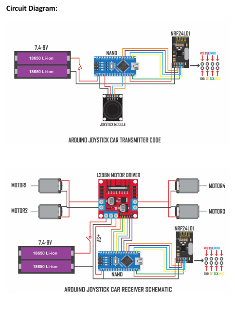

Here's a comprehensive `README.md` file for your GitHub repository, including details about the robotics football car project and the Robo-Soccer tournament:

---

# Robo-Soccer Tournament

Welcome to the Robo-Soccer Tournament GitHub repository! This repository contains all the necessary resources, including the circuit diagrams, code, and instructions to build and program the robots used in our Robo-Soccer tournament held at IIITG under the Technocrats Club. The tournament featured exciting matches where teams competed with their customized robots in a thrilling soccer-like game.



## Table of Contents

- [Overview](#overview)
- [Circuit Diagrams](#circuit-diagrams)
- [Hardware Requirements](#hardware-requirements)
- [Software Requirements](#software-requirements)
- [Getting Started](#getting-started)
- [Code Overview](#code-overview)
- [Robo-Soccer Tournament](#robo-soccer-tournament)
- [YouTube Montage](#youtube-montage)
- [License](#license)

## Overview

Robo-Soccer is a competitive event where teams of two robots, each consisting of one defender and one attacker, face off in a soccer-like game. The tournament is divided into three rounds:

1. **Qualifying Round**
2. **Elimination Round**
3. **Playoffs Round**

Participants built robots using Arduino, motor drivers, NRF24L01 wireless modules, and other components to navigate and control the robot’s movements in the game.

## Circuit Diagrams

The following circuit diagrams illustrate the wiring setup for the transmitter and receiver units of the robotics car:

### Transmitter Circuit
- **Components:** Arduino Nano, Joystick Module, NRF24L01, 18650 Li-ion Battery.
- **Function:** The joystick sends control signals to the receiver module wirelessly via the NRF24L01.

### Receiver Circuit
- **Components:** Arduino Nano, L298N Motor Driver, NRF24L01, 4 DC Motors, 18650 Li-ion Battery.
- **Function:** The receiver interprets the signals and controls the motors to move the robot accordingly.

## Hardware Requirements

- Arduino Nano (2 units)
- Joystick Module
- L298N Motor Driver
- DC Motors (4 units)
- NRF24L01 Wireless Transceiver Modules (2 units)
- 18650 Li-ion Batteries (4 units)
- Battery Holders, Wires, and Connectors
- Breadboard and Jumper Wires

## Software Requirements

- [Arduino IDE](https://www.arduino.cc/en/software)
- Required Arduino libraries:
  - `SPI.h`
  - `nRF24L01.h`
  - `RF24.h`

## Getting Started

1. **Clone the Repository:**
   ```bash
   git clone https://github.com/yourusername/Robo-Soccer.git
   ```
2. **Install Arduino IDE and Required Libraries:**
   - Download and install the Arduino IDE from the official website.
   - Install the necessary libraries (`SPI`, `nRF24L01`, `RF24`) through the Arduino Library Manager.

3. **Upload the Transmitter and Receiver Codes:**
   - Use the Arduino IDE to upload the provided transmitter and receiver codes to the respective Arduino Nano boards.

4. **Assemble the Circuit:**
   - Follow the circuit diagrams to assemble the transmitter and receiver circuits.

5. **Power Up and Test:**
   - Power the circuits using the 18650 Li-ion batteries.
   - Test the joystick movements and ensure the motors respond accordingly.

## Code Overview

### Receiver's Code (Car)

The receiver's code is responsible for interpreting the joystick inputs received via the NRF24L01 module and controlling the motors' speed and direction.

```cpp
#include <SPI.h> 
#include <nRF24L01.h> 
#include <RF24.h> 

#define enA 2   
#define in1 3 
#define in2 4 
#define enB 7    
#define in3 5 
#define in4 6 
RF24 radio(8,9); // CE, CSN 
const byte address[6] = "00001"; // Unique Code

// Define motor speed variables, setup, and loop functions as required
```

The code reads the joystick's X and Y axis values, maps them to control the speed and direction of the motors, and sends PWM signals to the motor driver.

### Transmitter's Code

The transmitter code reads the joystick's position and sends the data wirelessly to the receiver using the NRF24L01 module.

## Robo-Soccer Tournament

The tournament was held in three phases:

1. **Qualifying Round:** Teams competed to qualify for the elimination round.
2. **Elimination Round:** Qualified teams faced off in a knockout format.
3. **Playoffs Round:** The top teams competed in the final round to determine the winner.

## YouTube Montage

Check out the highlights of the Robo-Soccer tournament on YouTube:

[](https://www.youtube.com/watch?v=YOUR_VIDEO_ID)

## License

This project is licensed under the MIT License - see the [LICENSE](LICENSE) file for details.

---

Feel free to customize the README file further according to your preferences!
